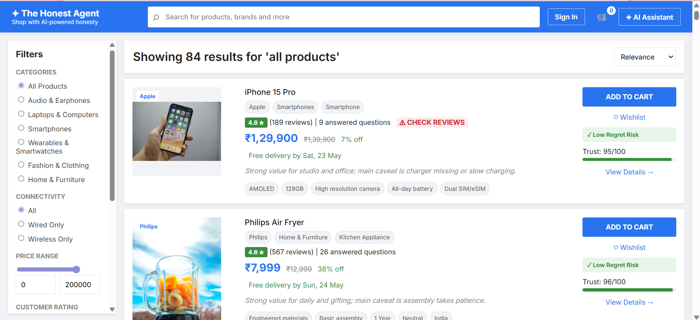
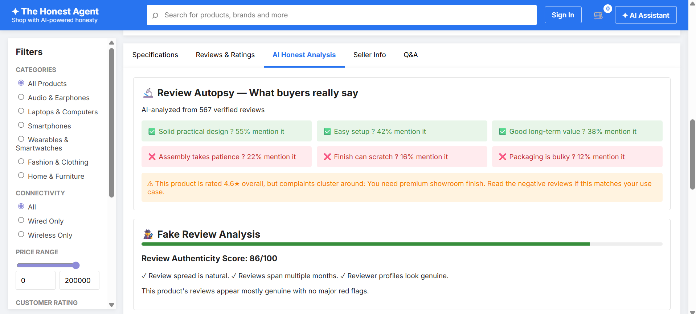
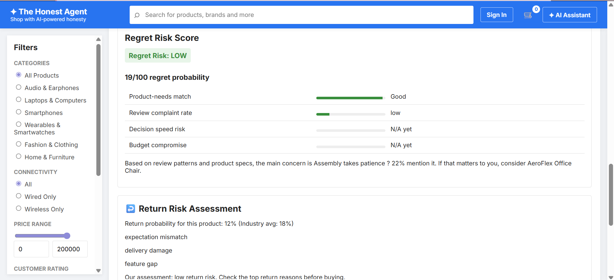
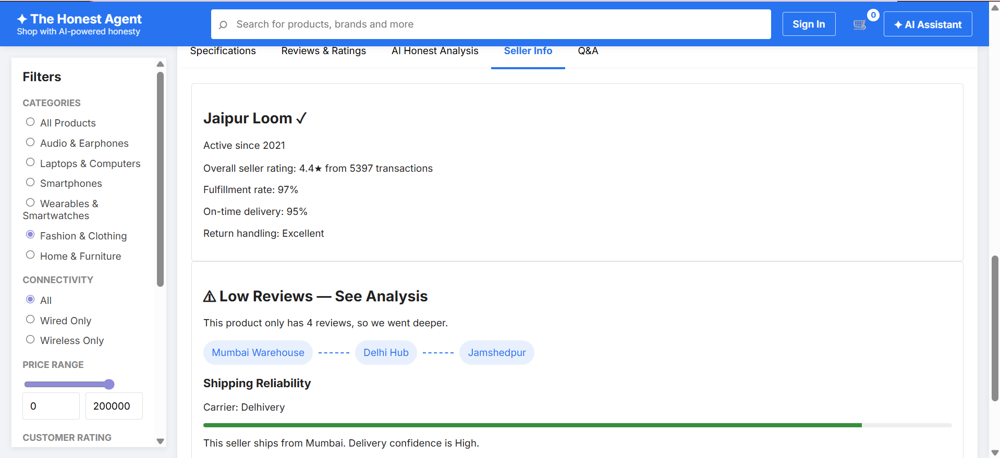
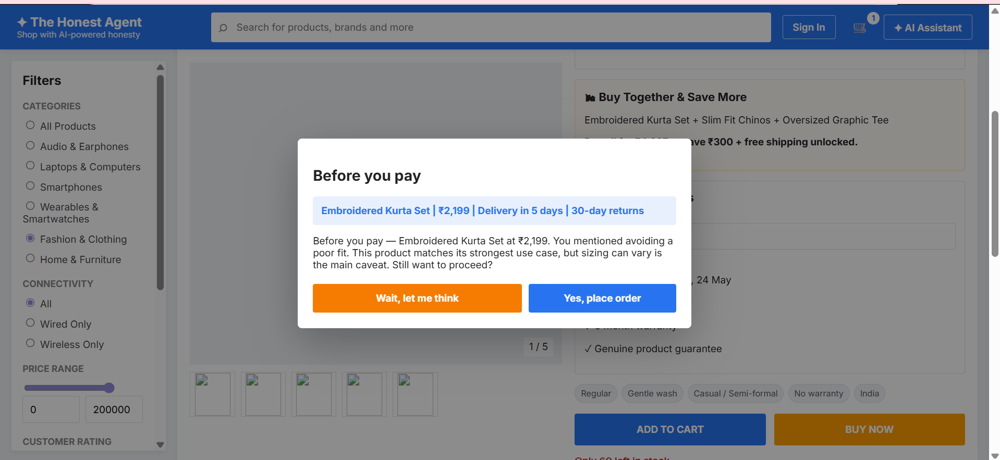

# ✦ The Honest Agent
### AI Shopping Agent that sells through radical transparency

**Team Niraya** — Ria Agrawal & Nishan Kashyap  
**Hackathon:** Kasparro AI Shopping Agent Track (Track 1)

---

## The Problem
Online shoppers abandon carts not because they can't find products — but because they don't trust the recommendation. Existing AI shopping tools are glorified search bars. They serve the store, not the buyer.

## Our Solution
The Honest Agent acts as the buyer's advocate. It actively surfaces what could go wrong with a product before recommending it, detects impulse-buy psychology, and builds trust through radical transparency. The paradox: the more honestly it talks you out of a bad purchase, the more you trust it — and the more likely you are to buy the right product through it.

---

## Demo Video
📹 [Watch the demo](YOUR_DEMO_LINK_HERE)

---

## Screenshots

### 84 products with Trust Score & Regret Risk on every card


### Review Autopsy — AI-analyzed from real review patterns


### Regret Risk Score — broken down by 4 dimensions


### Trust Provenance Engine — for low-review products like this Banarasi Silk Saree


### Checkout Guardian — "Wait, let me think" before every purchase


---

## Features

| Feature | What it does |
|---------|-------------|
| **Review Autopsy** | AI-analyzed review patterns — loved vs regretted, with % mentions and use-case mismatches |
| **Fake Review Detector** | Authenticity score 0-100 with signals like review spread and reviewer profiles |
| **Regret Risk Score** | Traffic-light badge broken down by product-needs match, complaint rate, decision speed, budget compromise |
| **Return Risk Assessment** | Return probability vs industry average with top return reasons |
| **Trust Provenance Engine** | For <5 review products: seller history, shipping route map, delivery confidence score |
| **Impulse Guardian** | Detects urgency/validation signals in conversation and slows the user down |
| **Checkout Guardian** | Honest 10-second sign-off before payment — "Wait, let me think" is the prominent button |
| **Quick-Reply Chips** | Category-specific chips on every agent question — no typing needed |
| **AI Assistant** | Full conversational agent with budget enforcement, brand filtering, use-case reranking |

---

## Tech Stack
- **Frontend:** Vanilla JS + Tailwind CSS (single page, no build step)
- **Backend:** Node.js + Express (ES modules)
- **AI:** Google Gemini (gemini-2.0-flash) via AI Studio
- **Data:** 84-product mock catalog with 15+ reviews per product
- **Session state:** In-memory (no database needed)

---

## Setup Instructions

### Prerequisites
- Node.js v18 or higher
- A Google AI Studio API key — free at [aistudio.google.com](https://aistudio.google.com)

### Installation

```bash
# 1. Clone the repository
git clone https://github.com/YOUR_USERNAME/the-honest-agent.git
cd the-honest-agent

# 2. Install dependencies
npm install

# 3. Set your Gemini API key
# Windows:
set GEMINI_API_KEY=your_key_here
# Mac/Linux:
export GEMINI_API_KEY=your_key_here

# 4. Start the server
node server.js

# 5. Open browser at http://localhost:3000
```

---

## Project Structure

```
the-honest-agent/
├── data/
│   └── catalog.json
├── public/
│   ├── index.html
│   ├── app.js
│   ├── styles.css
│   └── confirmation.html
├── screenshots/
├── server.js
├── PRODUCT_DOCUMENT.md
├── TECHNICAL_DOCUMENT.md
├── DECISION_LOG.md
├── DEMO_SCRIPTS.md
└── README.md
```

---

## Contribution Note
**Ria Agrawal** — Product thinking, feature design, UX, conversation flow, all documentation and demo script. Defined the core "advocate not salesperson" philosophy.

**Nishan Kashyap** — Engineering, server architecture, AI integration, frontend state management, full-stack implementation of all features.

Both contributed jointly to feature ideation, demo preparation, and testing.

---

*Built with honesty. For buyers who deserve better.*
